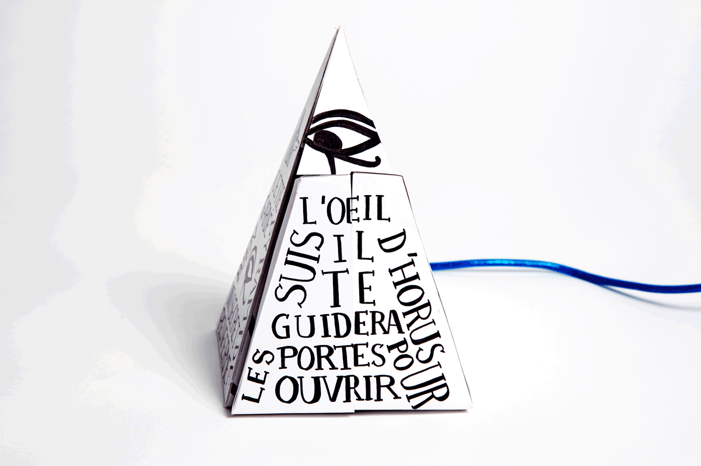
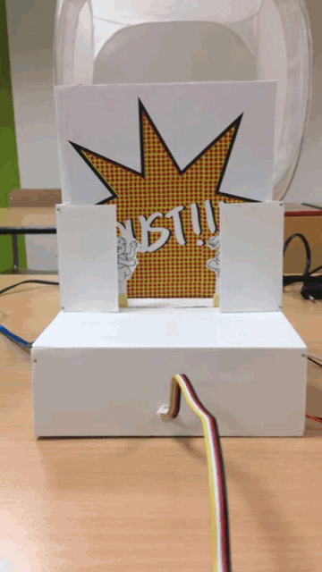
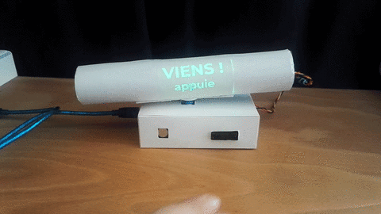

# projet_dis-information_signals_1819
This project is an arduino class for graphic designers @lecoldedesign. Code and building instructions are available [here](https://github.com/AtelierNum/projet_dis-information_signals_1819)

This project is loosely inspired by [papersignals](https://papersignals.withgoogle.com/)

Ce projet est le résultat d'une initiation à arduino pour des étudiant en design graphique à l'école de design de Nantes. Le code est les instructions de constructions sont disponnibles [ici](https://github.com/AtelierNum/projet_dis-information_signals_1819)

Ce projet s'est librement inspiré de [papersignals](https://papersignals.withgoogle.com/)

## Papy râleur - Théodore Guellier-Di-Giulio et Ruellan Arthur

Papy râleur ne vous épargneras aucun bruit, vous entrez dans une pièce, papy est tranquillement branché à sa prise, il vous observe. Il suffit que vous haussiez le ton, et papy râleur entre en action il s’agite, il avance, il vous interpelle avec sa lampe et vous insulte de petit con. On ne dérange pas les personnes âgées.

## Joyeux Noël - Romane Girard et Jusine Multon

C’est à nouveau cette période magique de l’année où nos chères têtes blondes se voient ensevelies sous les cadeaux. Et si cette année, on regardait un peu plus loin que notre sapin, et qu’on se demandait qui sont les véritables lutins du père Noël? Pas de chance, si on a payé cette fusée robotisée à prix bas, c’est parce que c’est un enfant du tiers-monde qui l’a fabriquée… à l’année prochaine ! 

## Paradis du 72 - Fiona Bernaerts et Agathe de la Tribouille

Cette bombe artisanale est une satire du "rêve Djihadiste" dû à une mauvaise lecture du Coran : se faire exploser pour tuer ceux qu'ils jugent "mécréants" et rejoindre 72 vierges au paradis.

Les artifices invitent le spectateur à déclencher lui-même la bombe pour souligner l'effet absurde de l'attente de la mort.L'objet mortel est détourné en objet d'art absurde à la Magritte.

## Pyramide Enigmatique - Amandine Leroy et Caroline Bertin

Pour activer les portes de la pyramide, il vous faudra déchiffrer le message inscrit sur ses 4 faces en alliant texte et pictogrammes. 

Les inscriptions vous permettrons de vous informer sur la manipulation à faire mais attention, la lecture n’est pas aisée, elle peut vous tromper. 

Une fois les portes ouvertes, elles vous révéleront le sablier représentant le temps que vous avez perdu à percer le secret de la pyramide.

## Mariah Carré(s) - Léa Manchajm et Julia Haremza

Et si, le temps d’une expérimentation, vous vous jouiez d’une diva ? Mariah Carré(s) vous propose de vous gausser de la réalité des prestations vocales trafiquées des reines de la pop. 

Un bouton situé à l’oreille, recréant le geste emblématique de Mariah, déclenche à la pression du doigt un son désagréable et éclate un ballon… métaphore de vos tympans. 

Un cube grimé serait-il aussi talentueux que la diva légendaire ?

## La belle et la bête - Deborah Büsing et Emma Brossaud

La plante carnivore en apparence inoffensive, dévoile son animalité lors du contact. La tige de la
Belle peut évoquer le buste d’une femme fatale. La beauté extérieure laisse place à l’intériorité et
intimité de la Bête.

## Happy Park - Théo Denechere et Florian Galou

Il s’agit d’un dispositif numérique lumineux qui aide à se garer sur une place de parcking. Le dispositif est composés de 64 leds qui viennent indiquer à l’usager s’il est plus ou moins bien garé en fonction de son emplacement. Les leds permettent la créations de symboles lumineux, positif (vert), négatif (rouge), neutre (jaune).

## Oust ! - Pauline Gillet et Guillaume Graff

Vos deux enfants se disputent dans le couloir depuis plusieurs minutes. Agacés, vous commencez à vous énerver. En les grondant à travers le micro, ils retournent dans leurs chambres respectives. Mais attention, ils reviennent rapidement à la charge, restez donc attentif !

## Unouï - Farouk Khelfi et Robin Pierre

Toujours dérangé par les bruits en soirée ? Unouï résoudra ces problèmes de nuisances sonores. Grâce à un détecteur de haute précision cette enceinte nouvelle génération analysera le niveau sonore et diffusera un son plus ou moins désagréable pour inciter les utilisateurs à diminuer les nuisances sonores.
Ce son désagréable sera accompagné d'un indicateur textuel qui permettra d'évaluer à quel niveau les nuiseurs se situent. Ainsi, vous retrouvez de la tranquilité et du silence lors de vos prochaines soirées.

## The revolution will not be televised - Pauline Motel et Martin Sigler  

La télévision fonctionne en permanence à moins que quelqu’un ne l’éteigne. Une fois éteinte, un message incitant à agir devient lisible : « You will not be able to stay home, brother / The revolution will not be televised ». 

## ZZZ-BLA-BAM - Marie Königsdörfer et Jules Manoury

"ZZZ BLA BAM" est un outil permettant, grâce à son micro intégré, de savoir si le niveau sonore est faible, moyen ou fort.
Avec son système de LEDs, qui s'allumeront pour éclairer les différentes inscriptions typographiques, il est possible de savoir s'il est nécessaire de baisser le niveau sonore :
 - "ZZZ" est un niveau faible adapté au lieu concerné par cet objet (bibliothèque, coworking), vert
 - "BLA" est le niveau moyen et supportable, vert
 - "BAM" lorsque le niveau est trop fort, rouge

## Agorascript - Jade Charlet et Mathéo Lesage

L’agorascript est un dispositif qui permet, grâce à un mico et un capteur photosensible de retranscrire graphiquement l’ambiance d’un lieu par sa fréquentation et sa luminosité selon le moment de la journée. Dans le but de créer une banque d’image d’ambiances qui pourrait être utilisé par des personnes atteintes d’agoraphobie.

## Le père noël 2.0 - Inès Allomber et Romane Watrin

Le but de ce calendrier de l'avant, (avec le capteur de distance) est de dcouvrir
la verite sur l'exploitation du Pere Noel chez Coca-Cola,. Ainsi, nous mettons en valeur
la decadence de ce personnage a travers du capitalisme que nous retrouvons dans le titre dans lequel ERO se revele et symbolise le plaisir extreme jusqu'a saturation (psychanalyse freudienne). Par consequent, plus on se rapproche plus l'animation s'accelere ce qui fait un parallele entre la relation espace et temps, qui evolue au travers des quatre illustrations.

## Détecteur de coups de reins - Guillaume Papillon et Louise Lenepveu

Le détecteur de coups de rein est une invention ayant pour but d’augmenter visuellement et soutenir une expérience sexuelle. Lorsque d’une envie se fait sentir, posez vos sous- vêtements devant le detecteur pour mettre en route l’expérience. Grâce au micro, losqu’un son sera émis vous serez soutenu par une lumière violette, traduction visuelle du plaisir donné.

## Dégoûts des couleurs - Ambre Senlis et Bastien Dauvé

L’objet me demande d’approcher et d’appuyer sur le bouton . Quelle agréable surprise quand l’objet se retourne et m’a che un message me disant que je suis «Canon !». Vous imaginez ma déception lorsque j’appuie sur le bouton et qu’un tout autre message apparaît...

## Spooky - Selma Blondel et Justine Fabarez

« Spooky » est une veilleuse, nous avons détourné son usage premier, qui est de rassurer et nous l’avons transformé en un usage inverse.
Notre veilleuse est donc un objet qui au fur et à mesure que baisse la luminosité s’allume, une lumière rouge inquiétante s’en dégage.

Sa forme rappelant celle d’un insecte est modulable et composé de bande de papier.
Si l’on écarte les lamelles de papier on découvre à l’intérieur une petite « forêt » en rafia pourpre posé sur une plaque en plexi, cette dernière tourne, le mouvement accélère au fur et à mesure que la lumière s’allume.

Notre veilleuse une fois mise dans le noir est plus effrayante que rassurante, le mélange entre la lumière rouge, le bruit du moteur tournant renforce cette sensation.

